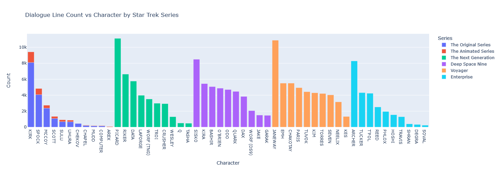

# Star Trek Dialogue Sentiment Data Analysis
A web scraping and sentiment data analysis of 707 Star Trek episodes, including The Original Series, The Animated Series, The Next Generation, Deep Space Nine, Voyager, and Enterprise.

To view the notebook file in its entirety, please visit the [rendered notebook here](https://nbviewer.org/github/tonyv-vo/Star-Trek-Dialogue-Data-Analysis/blob/main/project.ipynb).

## Introduction
Star Trek, a beloved science fiction franchise, has experienced remarkable growth since its initial release with The Original Series in 1966. Over the years, it has expanded to include a total of 11 television series, 13 movies, and an extensive range of games spanning various mediums such as board games, card games, and video games.

Though earlier series such as The Original Series and The Next Generation predominantly featured episodic storytelling, later series such as Deep Space Nine and Voyager adopted a more serialized approach. This data analysis project aims to explore and compare the distinctions between these earlier and later series, focusing on the contrasting narrative styles of episodic and serialized storytelling. By employing natural 
language processing techniques such as stop word removal, lemmatization, and sentiment analysis to analyze the dialogue from The Original Series, The Animated Series, The Next Generation, Deep Space Nine, 
Voyager, and Enterprise, I aim to highlight the divergent themes and levels of complexity across characters and series.

## Web Scraping
The data for the Star Trek episodes comes from the website [Chakoteya.net](http://www.chakoteya.net/StarTrek/index.html). The data is scraped using the Python library Beautiful Soup 4. 

In this project, the scraper navigates through each series and obtains the HTML source for each episode. Then, it uses Beautiful Soup 4 and regular expressions to extract both the character and the corresponding dialogue line. The data for every episode and series is saved as nested JSON objects, which will eventually be processed using the pandas library.

## Libraries and Tools used
* AFINN → sentiment lexicon by Finn Årup Nielsen for determining the sentiment of a word
* Beautiful Soup 4 → web scraping
* Matplotlib → displaying the word cloud image
* Natural Language Toolkit (NLTK) → data transformation, including tokenization, stop word removal, lemmatization, and part-of-speech tagging
* NumPy → text transformation and ordering data in dataframes
* pandas → data manipulation and analysis
* Plotly → plotting charts
* Regular Expressions → extracting characters and their lines from the dialogue
* scikit-learn → calculating the word weightings in the dialogue via Term Frequency - Inverse Document Frequency (TF-IDF)
* Wordcloud → generating a word cloud image

## Visualizations

## Installation and Usage
1. Download `AFINN-111.txt`, `Date_Corrections.csv`, `project.ipynb`, and `requirements.txt` and place all four files into the same directory.
2. Open a command prompt and navigate to the directory where the four files are located. Using Python 3, run the following command: `python -m pip -r requirements.txt` to install the required libraries.
3. Run the command `jupyter lab` to launch Jupyter Lab, then navigate to the `project.ipynb` notebook.
4. In Jupyter Lab, click "Run > Run All Cells". The notebook will take approximately five to ten minutes to run all cells and generate the output.

## Future Plans
In the future, I plan to enhance this project with the following modifications:
* Revamping the web scraping data pipeline: Currently, every execution of the notebook triggers data scraping. I would like to change this by channeling the data to a data warehouse such as Snowflake. Moreover, I want to introduce a feature enabling the user to decide whether to scrape the data again or utilize the existing data.
* Recoding with SQL: I would like to use rewrite the data analysis sections using SQL as an alternative to Pandas, primarily for my fun and to make a comparative speed analysis between using pandas and SQL.
* Advanced sentiment analysis: Another idea is to develop this sentiment analysis by delving deeper into the episodes through additional data sources (such as The Movie Database (TMDB)) to comprehend the underlying causes for each episode's sentiment score. This would also allow me to visualize of the correlation between an episode's theme and its associated sentiment score.

## Conclusion
In conclusion, the in-depth analysis of dialogues across six Star Trek series, from 1966 to 2005, offers fascinating insights into sentiment trends, character dialogue counts, and the use of speech in this 
influential franchise. While neutral sentiments prevailed, the analysis also highlighted a slight skew towards positivity. Interestingly, the latter series, Deep Space Nine and Voyager, exhibited a more 
positive sentiment trend, potentially due to serialized episodes featuring extended storylines culminating in significant conflict resolution. Further exploration with treemap visualization and a word cloud 
map revealed key dialogue components after the exclusion of stop words, underscoring the vast linguistic richness of the franchise. Despite some methodological limitations and weak correlations, these 
findings offer an intriguing examination of the Star Trek universe, adding a quantitative layer to our understanding of its enduring appeal.

## Attributions
This AFINN Sentiment Lexicon is made available under the Open Database License: http://opendatacommons.org/licenses/odbl/1.0/. Any rights in individual contents of the database are licensed under the Database Contents License: http://opendatacommons.org/licenses/dbcl/1.0/
